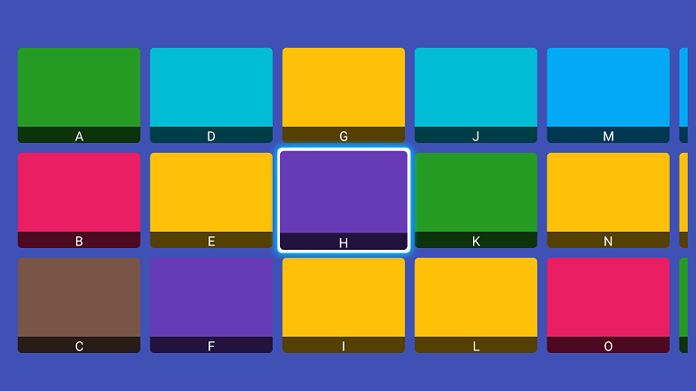
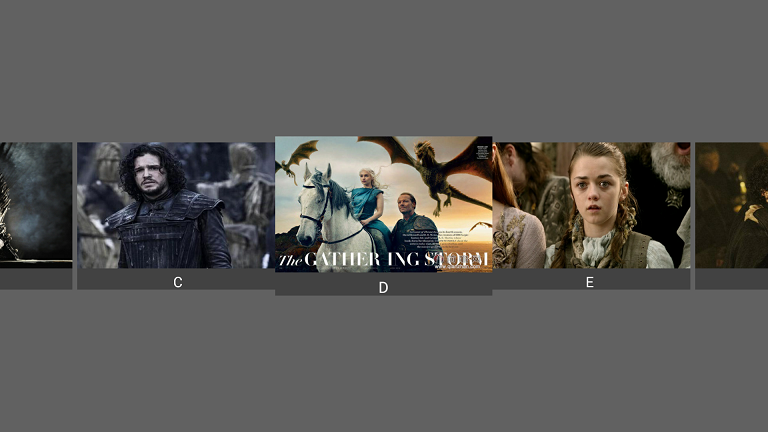
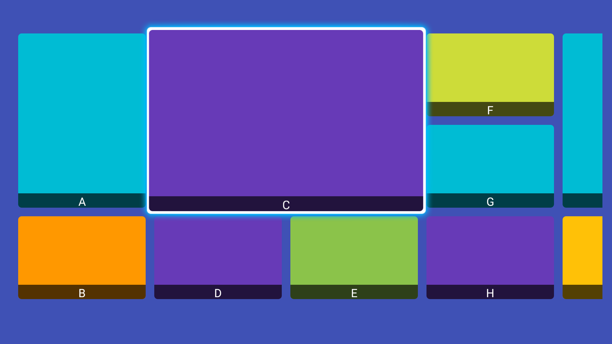

# TvRecyclerView
A custom RecyclerView for Android TV end.

## ScreenShot
<p>

<br/>
<br/>

<br/>
<br/>

</p>

## Usage
1.First you can add gradle dependency with command :
```groovy
dependencies {
    ......
    compile 'com.henryblue.library:tvrecyclerview:0.9.7'
   }

```
To add gradle dependency you need to open build.gradle (in your app folder,not in a project folder) then copy and add the dependencies there in the dependencies block;

2.Add TvRecyclerView in your layout
```
<app.com.tvrecyclerview.TvRecyclerView
        android:id="@+id/tv_recycler_view"
        android:layout_width="match_parent"
        android:layout_height="580dp"
        app:focusDrawable="@drawable/default_focus"/>
```

3.Set the LayoutManager and Adapter
```
 mTvRecyclerView = (TvRecyclerView) findViewById(R.id.tv_recycler_view);
 GridLayoutManager manager = new GridLayoutManager(NormalFocusActivity.this, 3);
 manager.setOrientation(LinearLayoutManager.HORIZONTAL);
 mTvRecyclerView.setLayoutManager(manager);

 int itemSpace = getResources().
                getDimensionPixelSize(R.dimen.recyclerView_item_space);
 mTvRecyclerView.addItemDecoration(new SpaceItemDecoration(itemSpace));
        
 NormalAdapter mAdapter = new NormalAdapter(this);
 mTvRecyclerView.setAdapter(mAdapter);

 mTvRecyclerView.setOnItemStateListener(new TvRecyclerView.OnItemStateListener() {
      @Override
      public void onItemViewClick(View view, int position) {
          Log.i(TAG, "you click item position: " + position);
      }

      @Override
      public void onItemViewFocusChanged(boolean gainFocus, View view, int position) {
      }
 });
 mTvRecyclerView.setSelectPadding(35, 34, 35, 38);
```

## XML attributes

```xml
    <app.com.tvrecyclerview.TvRecyclerView
        ...
        app:scrollMode="followScroll"
        app:isAutoProcessFocus="false"
        app:focusScale="1.04f"
        app:focusDrawable="@drawable/default_focus"
        ...
        />
```

## XML attributes

| Name | Type | Default | Description |
|:----:|:----:|:-------:|:-----------:|
|scrollMode|enum|normalScroll| Set the way to slide |
|isAutoProcessFocus|boolean|true| Sets the focus of the control |
|focusScale|Float|1.04f| Set the focus scale. If 'isAutoProcessFocus' is true, this property has no effect, always equal 1.0f |
|focusDrawable|reference|null| set focus drawable, If 'isAutoProcessFocus' is true, this property has no effect |

## Public Methods

| Name |       Description            |
|:----:|:---------------:|
|setSelectedScale(float)| change value of focusScale |
|setIsAutoProcessFocus(boolean)| sets the focus of the control |
|setFocusDrawable(Drawable)| sets the focus of the drawable |
|setItemSelected(int)| sets the position of item gets focus |
|setSelectPadding(int,int,int,int)| sets the focus of the drawable padding, make the drawable include item |

Note: Because I extended RecyclerView you can use all RecyclerView public methods too.


## License
```
Copyright 2016 henryblue

Licensed under the Apache License, Version 2.0 (the "License");
you may not use this file except in compliance with the License.
You may obtain a copy of the License at

http://www.apache.org/licenses/LICENSE-2.0

Unless required by applicable law or agreed to in writing, software
distributed under the License is distributed on an "AS IS" BASIS,
WITHOUT WARRANTIES OR CONDITIONS OF ANY KIND, either express or implied.
See the License for the specific language governing permissions and
limitations under the License.

```

